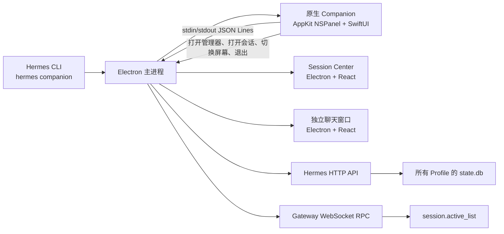

# Hermes Companion 混合原生架构介绍

Hermes Companion 是一个常驻桌面的 Session 状态监控器。它采用混合桌面架构：

- **AppKit + SwiftUI** 负责 macOS 刘海悬浮窗；
- **Electron 主进程**负责生命周期、数据聚合与窗口调度；
- **React** 继续承载完整的 Session Center 和聊天界面；
- **Hermes HTTP API 与 Gateway RPC** 仍是 Session 数据的权威来源。

这套架构的核心原则是：

> 将高频、延迟敏感的交互放在原生层，将复杂、数据密集的管理功能留在现有 Web 层。

它既获得了原生悬浮窗的流畅度，又避免用 Swift 重写整套 Hermes Desktop。

## 一、为什么改用混合原生架构

第一版 Companion 使用透明 Electron `BrowserWindow` 同时实现收起刘海和展开列表。功能可以工作，但存在几个结构性性能问题：

1. 透明 Chromium 窗口需要持续参与桌面合成；
2. CSS 动画同时修改 `width`、`height`、阴影和圆角，会反复触发布局与重绘；
3. 点击穿透依赖轮询和 Electron 窗口 API；
4. 一个很小的悬浮窗仍挂载了完整 React Provider、虚拟列表和 Session Center 状态；
5. 早期实现甚至在 50 ms 定时器中同步启动 Swift 几何检测程序，相当于每秒创建约 20 个进程。

逐项优化可以缓解问题，却无法消除透明 Chromium 悬浮窗本身的成本。最终方案没有继续微调动画参数，而是重新划分职责边界。

## 二、总体架构



整个系统分为三层。

### 1. 原生展示层

原生 Swift 程序只负责：

- 刘海定位；
- 透明区域点击穿透；
- 鼠标悬停与延迟收起；
- Spring 形变动画；
- 最多六条紧凑 Session 状态；
- 显示器切换；
- 将用户操作发送给 Electron。

它不直接读取数据库，不连接 Gateway，也不执行归档、删除等业务操作。

### 2. Electron 编排层

Electron 继续充当桌面应用协调器：

- 启动和关闭原生 Companion 进程；
- 恢复 Companion 启用状态和显示器选择；
- 聚合历史 Session 与实时运行状态；
- 向原生进程发送轻量快照；
- 打开 Session Center 和独立聊天窗口；
- 响应 CLI 单实例参数转发；
- 为 Windows/Linux 保留 Electron 置顶窗降级方案。

### 3. React 管理层

完整 Session Center 继续使用 React，因为它包含大量复杂但低频的管理交互：

- 全 Profile 分页、搜索和筛选；
- 最近消息与压缩摘要；
- 收藏、重命名、归档、恢复和删除；
- Legacy JSON 历史；
- 批量操作与部分失败提示。

这样可以复用已有桌面能力，避免同时维护 Swift 和 React 两套 Session 管理器。

## 三、原生窗口模型

macOS 悬浮层使用无边框、非激活式 `NSPanel`：

```text
NSPanel
├── screen-saver 窗口层级
├── 跨所有 Space，可覆盖全屏应用
├── 透明背景
├── 固定 560 x 430 原生窗口
└── NSHostingView<CompanionView>
```

窗口在收起和展开时始终保持固定尺寸。SwiftUI 只改变窗口内部真正可见的内容区域。

职责分工非常明确：

- **AppKit 负责窗口位置、层级、跨空间和事件语义；**
- **SwiftUI 负责形状、圆角、透明度、内容位移和 Spring 动画。**

如果同时用 AppKit 调整窗口尺寸、再用 SwiftUI 做内部 Spring，就会出现两套动画系统互相竞争，产生抖动和掉帧。固定窗口让 SwiftUI 始终工作在稳定坐标系中，也更利于 macOS 合成器处理动画。

## 四、点击穿透与悬停

固定窗口比真正显示的刘海区域更大，因此透明部分不能挡住后面的应用。

自定义 `NSHostingView` 覆盖 `hitTest`：

```text
鼠标位于可见刘海区域  -> 将事件交给 SwiftUI
鼠标位于透明空白区域  -> 返回 nil，事件穿透到底层应用
```

悬停状态由全局和局部 `NSEvent` 监听器处理。鼠标移动检测限制为每 50 ms 一次，但视觉动画完全由 SwiftUI 驱动，不通过 Electron IPC 逐帧传递。

交互延迟经过刻意设计：

- 进入 120 ms 后展开，避免路过时误触；
- 离开 450 ms 后收起，避免窗口形变造成反复开合；
- 关闭动画完成前保留内容，防止突然卸载导致闪烁。

## 五、进程通信

Electron 与原生程序通过标准输入输出传递换行分隔 JSON，即 JSON Lines。

Electron 发送：

```json
{"type":"snapshot","connected":true,"displayId":"1","sessions":[]}
{"type":"display","displayId":"1"}
{"type":"mode","mode":"expanded"}
{"type":"quit"}
```

原生程序返回：

```json
{"type":"openCenter"}
{"type":"openSession","sessionId":"abc123","profile":"work"}
{"type":"setDisplay","displayId":"2"}
{"type":"exitCompanion"}
```

这个协议有意保持很小：

- 容易观察、调试和测试；
- 不向原生程序开放任意文件或 Electron API；
- Swift 程序不依赖 Node 模块；
- 主进程退出后管道自然关闭；
- 单条错误消息不会破坏整个应用。

原生 Companion 本质上是一个展示客户端，而不是第二套业务后端。

## 六、Session 数据流

Companion 合并两类数据。

### 历史状态

Electron 请求 `/api/profiles/sessions`，读取所有本地 Profile 的 `state.db`，同时合并远程 Profile，得到：

- Durable Session ID；
- 标题与预览；
- Profile；
- 模型；
- 最近活动时间；
- 归档和历史元数据。

### 实时状态

Electron 只连接已经运行的 Profile Gateway，并调用 `session.active_list`，得到：

- `starting`；
- `working`；
- `waiting`；
- `idle`。

实时 Session 优先排列，历史 Session 用于填充剩余位置。最终按状态优先级和最近活动时间排序，最多发送六条给原生悬浮窗。

轮询受到明确约束：

- 每两秒向原生层发送一次紧凑快照；
- Gateway 实时结果使用短缓存；
- 不会为了监控而自动启动离线 Profile；
- 原生进程自身不访问数据库、不轮询网络。

## 七、刘海与多显示器定位

显示器几何来自 AppKit：

- `NSScreen.frame`；
- `visibleFrame`；
- `safeAreaInsets`；
- `auxiliaryTopLeftArea`；
- `auxiliaryTopRightArea`；
- 屏幕 ID 与名称。

有物理刘海的 Mac 优先适配真实刘海宽高。没有刘海的显示器则在状态栏中央绘制平顶、底部圆角的模拟刘海。

显示器选择由 Electron 持久化。切换屏幕后只向原生进程发送新的屏幕 ID，由原生面板原地重新定位，无需重启。

## 八、跨平台方案

原生实现只用于 macOS，因为核心能力依赖 AppKit 的窗口机制。

| 平台 | 紧凑 Companion | Session Center |
| --- | --- | --- |
| macOS | AppKit/SwiftUI 原生面板 | Electron/React |
| Windows | Electron 普通置顶窗 | Electron/React |
| Linux | Electron 普通置顶窗 | Electron/React |

这是一种渐进增强：数据接口和完整管理器保持跨平台，macOS 额外获得适合刘海悬浮窗的系统级体验。

## 九、构建与打包

原生代码由以下脚本编译：

```bash
cd apps/desktop
node scripts/build-companion-native.cjs
```

脚本生成：

- `hermes-companion-geometry`；
- `hermes-companion-native`。

开发构建输出到：

```text
apps/desktop/build/native-tools/
```

Electron Builder 会将整个目录复制到安装包资源中。运行时根据 `app.isPackaged` 选择源码构建路径或安装包资源路径。

正常生产构建会同时构建原生程序和 Web 前端：

```bash
npm run build
```

## 十、性能设计原则

这次改造形成了几条可以复用到其他桌面悬浮组件的经验。

### 1. 固定原生窗口，只动画内部内容

不要同时动画 `setFrame`、`setBounds` 和内部 UI。一次性分配最大窗口区域，再在内部改变可见形状。

### 2. 高频交互留在同一进程

悬停、命中测试和逐帧动画不应频繁跨 Electron IPC，也不应依赖主进程定时调用窗口 API。

### 3. 常驻层只接收最小数据

原生悬浮窗只接收已经排序好的六条展示数据，不加载完整 Session Center 数据模型。

### 4. 轮询数据，不轮询几何

屏幕几何只在显示器新增、移除或参数变化时刷新。必须缓存结果，不能在定时器里反复启动原生辅助进程。

### 5. 监控与管理分离

常驻悬浮层适合展示状态和快速跳转。搜索、分页、确认框、删除和批量操作应放在独立管理窗口中。

### 6. 关注空闲成本

悬浮窗绝大多数时间处于空闲状态。动画期间的短暂 CPU 峰值可以接受，但动画结束后必须迅速回落。

## 十一、许可证边界

架构设计参考了成熟的开源刘海应用，但参考项目使用 GPL-3.0，不能直接复制源码到 MIT 许可的 Hermes 中，否则会改变组合发布的许可证义务。

本项目采用 Clean-room 实现：

- 学习外部可观察行为和通用架构思路；
- 单独设计 Hermes 的进程和数据协议；
- 编写原创 AppKit/SwiftUI 实现；
- 不复制源码、资源、品牌或具有独创性的实现细节。

`NSPanel`、`NSHostingView`、SwiftUI 动画和原生事件监听属于通用技术方案；具体 GPL 源码则不能在不遵守 GPL 的情况下直接并入 MIT 项目。

## 十二、代码索引

| 职责 | 文件 |
| --- | --- |
| 原生 AppKit/SwiftUI 应用 | `electron/native/macos-companion-app.swift` |
| 显示器几何辅助程序 | `electron/native/macos-companion.swift` |
| 原生二进制路径解析 | `electron/companion-native.cjs` |
| 进程生命周期与数据桥 | `electron/main.cjs` |
| 原生构建脚本 | `scripts/build-companion-native.cjs` |
| Session Center React UI | `src/app/companion/index.tsx` |
| Session Center 状态工具 | `src/app/companion/model.ts` |
| Desktop HTTP API 客户端 | `src/hermes.ts` |
| Session REST API | `../../hermes_cli/web_server.py` |

## 十三、适用场景

当产品同时具备以下两类界面时，适合采用这种混合架构：

- 一个很小、常驻、动画敏感、需要深度系统集成的界面；
- 一个复杂但已经由 Electron/Web 实现的完整管理界面。

普通、短时存在且动画要求不高的窗口，直接使用 Electron 更简单。只有当大部分产品功能都需要系统原生控件时，才值得进一步改造成全原生应用。

对 Hermes Companion 而言，这个边界用最小的原生代码获得了关键体验提升，同时保留了现有 Desktop 的跨平台能力和开发效率。
